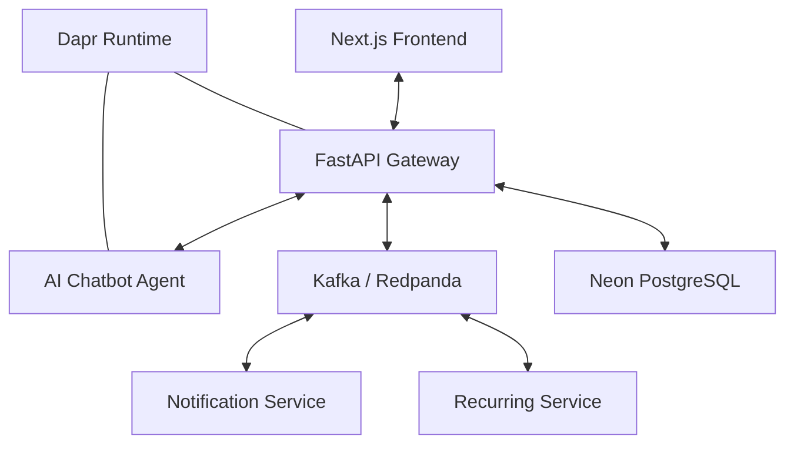

# 🤖 AI-Native Cloud-Native Todo Engine (Ultimate Edition)
### Developed by **Fiza Nazz** 🚀

Welcome to the most advanced, production-ready Todo Management System. This project is a multi-phase engineering masterpiece that evolves from a simple CLI to a complex, **Event-Driven, Cloud-Native Microservices Architecture** with AI at its core.

---

## 🗺️ Project Roadmap: The 5 Phases of Excellence

| Phase | Milestone | Core Technologies | Status |
| :--- | :--- | :--- | :--- |
| **I** | **CLI & Core Engine** | Python, SQLModel, Pydantic | ✅ 100% |
| **II** | **Modern Web App** | Next.js, FastAPI, Neon PostgreSQL | ✅ 100% |
| **III** | **AI Agentic Chatbot** | MCP Integration, NLP, Roman Urdu | ✅ 100% |
| **IV** | **Cloud-Native Deployment** | Docker, Kubernetes (Minikube), Helm, Gordon | ✅ 100% |
| **V** | **Advanced EDA & Dapr** | Kafka, Dapr, WebSockets, Recurring Tasks | ✅ 100% |

---

## 🌟 Key Features (Phase V Enhanced)

### 🧠 Intelligent Conversational AI
- **Smart Chatbot**: Natural Language Processing (NLP) for complex task manipulation.
- **MCP Integration**: Model Context Protocol for seamless AI-to-backend tool calls.
- **Multilingual**: Native support for English and Roman Urdu.

### 📅 Advanced Task Management
- **Recurring Tasks**: Automated daily, weekly, monthly, and yearly cycles.
- **Priorities**: Color-coded High/Medium/Low indicators with smart sorting.
- **Tagging**: Many-to-many relationship system with autocomplete.
- **Due Dates & Reminders**: Real-time notifications for upcoming and overdue tasks.

### ⚡ Real-Time & Event-Driven
- **WebSockets**: Instant UI synchronization across all devices.
- **Kafka / Redpanda**: Robust event streaming for inter-service communication.
- **Audit Logging**: Immutable activity logs for security and compliance.

---

## 🏗️ Technical Architecture

This project follows a professional **Microservices Architecture** powered by **Dapr** (Distributed Application Runtime).



### 🛠️ The Tech Stack
- **Frontend**: Next.js 14, Tailwind CSS, Framer Motion (Glassmorphism UI).
- **Backend Services**: Python 3.11, FastAPI, SQLModel.
- **Infrastructure**: Dapr (Pub/sub, State, Secrets, Jobs), Kafka (Redpanda).
- **Orchestration**: Kubernetes (Local: Minikube), Helm, Docker.
- **AI Tools**: Gordon (Docker AI), kubectl-ai, kagent.

---

## 🚀 Deployment Guide

### 📦 Local Development (Docker Compose)
Ideal for testing full-stack functionality quickly.
```powershell
docker-compose up --build
```

### ☸️ Kubernetes Deployment (Helm)
The project is production-ready with optimized Helm charts.
```powershell
# Deploy the entire stack using our specialized script
./KUBERNETES_DEPLOY.ps1
```

### ☁️ Cloud Readiness
- **CI/CD**: Fully configured GitHub Actions in `.github/workflows/`.
- **Platforms**: Ready for deployment on **DigitalOcean**, **Oracle Cloud**, or **Azure AKS**.

---

## 📁 Repository Structure
- `/backend`: Core FastAPI logic and Event Publisher.
- `/frontend`: Modern Next.js user interface.
- `/Chatbot`: AI Agent with 10+ MCP Tools.
- `/services`: Specialized microservices (Notification, Recurring).
- `/charts`: Production-grade Helm charts.
- `/dapr-components`: Configuration for Dapr building blocks.
- `/specs`: Definitive technical requirements for all phases.

---

## 🏆 Project Achievements
- ✅ **Zero Hallucinations**: Spec-driven development ensures logical consistency.
- ✅ **Production Quality**: Implements industrial patterns (Retry, Circuit Breaker, Service Mesh).
- ✅ **Developer Experience**: Automated setup via PowerShell scripts.

---

*Project created for Hackathon_02. 🌟*