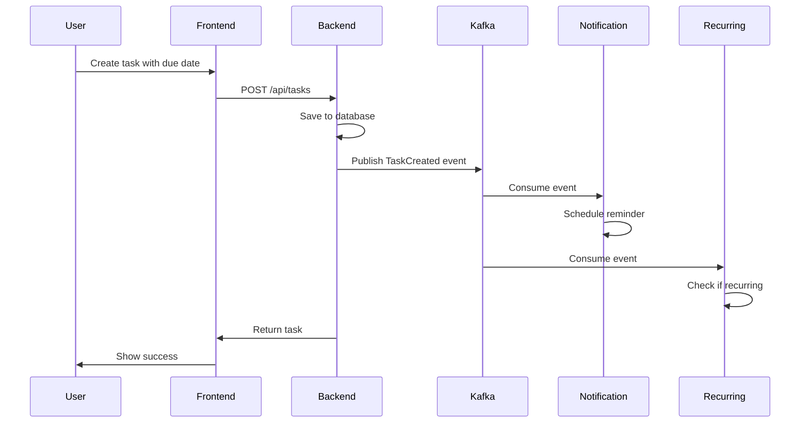
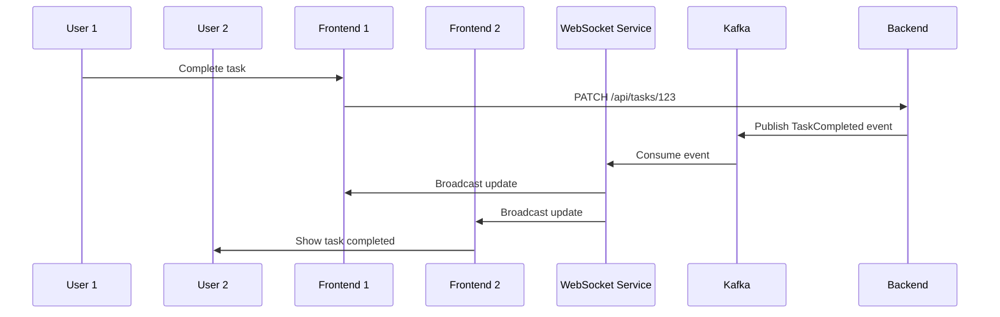

# PHASE V TECHNICAL PLAN
## Advanced Cloud Deployment - Implementation Architecture

### 🎯 IMPLEMENTATION STRATEGY
Transform Phase IV into production-grade system using event-driven architecture with Kafka + Dapr on Oracle Cloud.

---

## 📋 IMPLEMENTATION PHASES

### **PHASE A: Advanced Features (Days 1-2)**
Extend existing services with new functionality while maintaining backward compatibility.

### **PHASE B: Event-Driven Architecture (Days 2-3)**
Introduce Kafka messaging and refactor services for async communication.

### **PHASE C: Dapr Integration (Days 3-4)**
Add Dapr runtime and migrate to cloud-native patterns.

### **PHASE D: Cloud Deployment (Days 4-5)**
Deploy to Oracle Cloud with CI/CD pipeline and monitoring.

---

## 🏗️ DETAILED TECHNICAL PLAN

### **PHASE A: Advanced Features Implementation**

#### **A1: Database Schema Updates**
```sql
-- Add new columns to existing tasks table
ALTER TABLE tasks ADD COLUMN priority VARCHAR(10) DEFAULT 'medium';
ALTER TABLE tasks ADD COLUMN due_date TIMESTAMP NULL;
ALTER TABLE tasks ADD COLUMN recurring_pattern VARCHAR(20) NULL;
ALTER TABLE tasks ADD COLUMN recurring_interval INTEGER DEFAULT 1;
ALTER TABLE tasks ADD COLUMN parent_task_id INTEGER NULL;

-- Create new tables
CREATE TABLE task_tags (
    id SERIAL PRIMARY KEY,
    task_id INTEGER REFERENCES tasks(id),
    tag_name VARCHAR(50) NOT NULL,
    created_at TIMESTAMP DEFAULT NOW()
);

CREATE TABLE reminders (
    id SERIAL PRIMARY KEY,
    task_id INTEGER REFERENCES tasks(id),
    user_id VARCHAR(255) NOT NULL,
    remind_at TIMESTAMP NOT NULL,
    status VARCHAR(20) DEFAULT 'pending',
    created_at TIMESTAMP DEFAULT NOW()
);

CREATE TABLE audit_log (
    id SERIAL PRIMARY KEY,
    event_type VARCHAR(50) NOT NULL,
    aggregate_id VARCHAR(255) NOT NULL,
    user_id VARCHAR(255) NOT NULL,
    event_data JSONB NOT NULL,
    timestamp TIMESTAMP DEFAULT NOW()
);
```

#### **A2: Backend API Extensions**
```python
# New FastAPI endpoints
@app.put("/api/tasks/{task_id}/priority")
async def update_task_priority(task_id: int, priority: TaskPriority)

@app.post("/api/tasks/{task_id}/tags")
async def add_task_tags(task_id: int, tags: List[str])

@app.get("/api/tasks/search")
async def search_tasks(q: str, filters: TaskFilters)

@app.post("/api/tasks/{task_id}/recurring")
async def set_recurring_pattern(task_id: int, pattern: RecurringPattern)
```

#### **A3: Frontend UI Enhancements**
```typescript
// New React components
- TaskPrioritySelector.tsx
- TagManager.tsx
- SearchBar.tsx
- FilterPanel.tsx
- DueDatePicker.tsx
- RecurringTaskModal.tsx
```

#### **A4: Chatbot MCP Tool Updates**
```python
# Enhanced MCP tools
def set_task_priority(task_id: int, priority: str) -> Dict
def add_task_tags(task_id: int, tags: List[str]) -> Dict
def set_due_date(task_id: int, due_date: str) -> Dict
def create_recurring_task(title: str, pattern: str) -> Dict
```

---

### **PHASE B: Event-Driven Architecture**

#### **B1: Kafka Setup**
```yaml
# Local development (docker-compose)
version: '3.8'
services:
  redpanda:
    image: redpandadata/redpanda:latest
    command:
      - redpanda start
      - --smp 1
      - --memory 1G
      - --reserve-memory 0M
      - --node-id 0
      - --check=false
    ports:
      - "9092:9092"
      - "9644:9644"
```

#### **B2: Event Schemas**
```python
# Event models
class TaskEvent(BaseModel):
    event_id: str = Field(default_factory=lambda: str(uuid4()))
    event_type: str
    aggregate_id: str
    user_id: str
    timestamp: datetime = Field(default_factory=datetime.utcnow)
    version: int = 1
    data: Dict[str, Any]
    metadata: Dict[str, Any] = {}

class TaskCreatedEvent(TaskEvent):
    event_type: str = "task.created"
    data: TaskCreatedData

class TaskCompletedEvent(TaskEvent):
    event_type: str = "task.completed"
    data: TaskCompletedData
```

#### **B3: Event Publishers**
```python
# In backend service
class EventPublisher:
    def __init__(self, kafka_producer):
        self.producer = kafka_producer
    
    async def publish_task_created(self, task: Task, user_id: str):
        event = TaskCreatedEvent(
            aggregate_id=str(task.id),
            user_id=user_id,
            data=TaskCreatedData.from_task(task)
        )
        await self.producer.send("task-events", event.dict())
```

#### **B4: New Microservices**

##### **Notification Service**
```python
# notification_service/main.py
@app.on_event("startup")
async def startup():
    consumer = AIOKafkaConsumer(
        "reminders",
        bootstrap_servers="kafka:9092"
    )
    asyncio.create_task(consume_reminder_events(consumer))

async def consume_reminder_events(consumer):
    async for message in consumer:
        event = ReminderEvent.parse_raw(message.value)
        await send_notification(event)
```

##### **Recurring Task Service**
```python
# recurring_task_service/main.py
async def consume_task_completed_events(consumer):
    async for message in consumer:
        event = TaskCompletedEvent.parse_raw(message.value)
        if event.data.recurring_pattern:
            await create_next_occurrence(event)
```

##### **WebSocket Service**
```python
# websocket_service/main.py
class ConnectionManager:
    def __init__(self):
        self.active_connections: List[WebSocket] = []
    
    async def broadcast_task_update(self, event: TaskEvent):
        for connection in self.active_connections:
            await connection.send_json(event.dict())
```

---

### **PHASE C: Dapr Integration**

#### **C1: Dapr Components Configuration**
```yaml
# dapr-components/kafka-pubsub.yaml
apiVersion: dapr.io/v1alpha1
kind: Component
metadata:
  name: kafka-pubsub
spec:
  type: pubsub.kafka
  version: v1
  metadata:
  - name: brokers
    value: "kafka:9092"
  - name: consumerGroup
    value: "todo-service"
```

```yaml
# dapr-components/state-store.yaml
apiVersion: dapr.io/v1alpha1
kind: Component
metadata:
  name: statestore
spec:
  type: state.postgresql
  version: v1
  metadata:
  - name: connectionString
    secretKeyRef:
      name: db-secret
      key: connectionString
```

#### **C2: Service Refactoring for Dapr**
```python
# Replace direct Kafka usage with Dapr
async def publish_event_via_dapr(event_type: str, data: dict):
    async with httpx.AsyncClient() as client:
        await client.post(
            "http://localhost:3500/v1.0/publish/kafka-pubsub/task-events",
            json={"type": event_type, "data": data}
        )

# Replace direct DB calls with Dapr state
async def save_conversation_state(conv_id: str, messages: list):
    async with httpx.AsyncClient() as client:
        await client.post(
            "http://localhost:3500/v1.0/state/statestore",
            json=[{
                "key": f"conversation-{conv_id}",
                "value": {"messages": messages}
            }]
        )
```

#### **C3: Dapr Jobs API for Reminders**
```python
# Schedule reminder using Dapr Jobs API
async def schedule_reminder(task_id: int, remind_at: datetime):
    async with httpx.AsyncClient() as client:
        await client.post(
            f"http://localhost:3500/v1.0-alpha1/jobs/reminder-{task_id}",
            json={
                "dueTime": remind_at.isoformat(),
                "data": {
                    "task_id": task_id,
                    "type": "reminder"
                }
            }
        )
```

---

### **PHASE D: Cloud Deployment**

#### **D1: Oracle Cloud Setup**
```bash
# Create OKE cluster
oci ce cluster create \
  --compartment-id $COMPARTMENT_ID \
  --name todo-chatbot-cluster \
  --vcn-id $VCN_ID \
  --kubernetes-version v1.28.2 \
  --node-pools '[{
    "name": "worker-pool",
    "node-shape": "VM.Standard.E2.1.Micro",
    "node-count": 2,
    "subnet-id": "'$SUBNET_ID'"
  }]'
```

#### **D2: Helm Chart Updates**
```yaml
# charts/todo-chatbot/values.yaml
dapr:
  enabled: true
  components:
    - kafka-pubsub
    - postgresql-state
    - kubernetes-secrets

kafka:
  external: true
  bootstrapServers: "your-cluster.cloud.redpanda.com:9092"
  
services:
  backend:
    replicas: 2
    dapr:
      enabled: true
      appId: "backend-service"
      appPort: 8000
  
  notification:
    replicas: 1
    dapr:
      enabled: true
      appId: "notification-service"
      appPort: 8002
```

#### **D3: CI/CD Pipeline**
```yaml
# .github/workflows/deploy.yml
name: Deploy to Oracle Cloud
on:
  push:
    branches: [main]

jobs:
  test:
    runs-on: ubuntu-latest
    steps:
      - uses: actions/checkout@v3
      - name: Run tests
        run: |
          docker-compose -f docker-compose.test.yml up --abort-on-container-exit
  
  deploy:
    needs: test
    runs-on: ubuntu-latest
    steps:
      - name: Setup kubectl
        uses: azure/setup-kubectl@v3
      
      - name: Deploy to OKE
        run: |
          helm upgrade --install todo-chatbot ./charts/todo-chatbot \
            --set image.tag=${{ github.sha }} \
            --set kafka.bootstrapServers=${{ secrets.KAFKA_BOOTSTRAP_SERVERS }}
```

---

## 📊 SERVICE INTERACTION FLOW

### **Task Creation Flow**


### **Real-time Update Flow**


---

## 🔧 DEVELOPMENT WORKFLOW

### **Step-by-Step Implementation**
1. **Database migrations** - Update schema for new features
2. **Backend API extensions** - Add new endpoints
3. **Frontend UI updates** - New components and features
4. **Chatbot enhancements** - Updated MCP tools
5. **Kafka integration** - Event publishing and consuming
6. **New microservices** - Notification, Recurring, WebSocket
7. **Dapr migration** - Replace direct dependencies
8. **Local testing** - Minikube deployment
9. **Cloud deployment** - Oracle OKE setup
10. **CI/CD pipeline** - GitHub Actions automation

### **Testing Strategy**
- **Unit tests** for all new functions
- **Integration tests** for API endpoints
- **Event flow tests** for Kafka messaging
- **End-to-end tests** for complete workflows
- **Load tests** for performance validation

---

## 📈 MONITORING & OBSERVABILITY

### **Metrics Collection**
```yaml
# Prometheus configuration
scrape_configs:
  - job_name: 'todo-services'
    kubernetes_sd_configs:
      - role: pod
    relabel_configs:
      - source_labels: [__meta_kubernetes_pod_annotation_prometheus_io_scrape]
        action: keep
        regex: true
```

### **Grafana Dashboards**
- **Service Health** - Response times, error rates
- **Kafka Metrics** - Message throughput, lag
- **Dapr Metrics** - Sidecar performance
- **Business Metrics** - Task creation rates, user activity

---

**This technical plan provides the complete roadmap for Phase V implementation.**